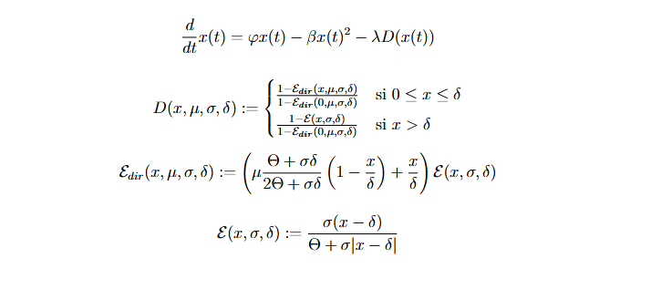

# TFG: Ajust d'equacions diferencials ordinàries a dades de sèries temporals curtes

## Introducció

En aquest projecte s’implementen, en llenguatge de programació C, tres mètodes heurístics per a l’ajust d’un model diferencial de la dinàmica poblacional de les gavines del Delta de l’Ebre a una sèrie temporal del nombre d’individus:

- **Algorisme genètic discret**
- **Algorisme genètic continu**
- **Algorisme** ***Simulated Annealing***

El model seleccionat es presenta a la secció 6.1 del treball i es defineix a partir de les següents expressions:




L’ajust es fa a la fase de col·lapse (2006–2016) de la població:


En aquest ajust, alguns paràmetres tenen valors fixos, estimats a partir de l’ajust a altres fases. Per a més detalls, veure [1].  
El model depèn de sis paràmetres: `x0`, `φ`, `λ`, `μ`, `σ` i `δ`.

---

## Requisits

Per compilar i executar aquest projecte mitjançant els scripts `bash`, cal tenir:

- **Bash**
- **Compilador de C (`gcc`)**
- **Python 3** (només per executar els scripts d’anàlisi)
  - Llibreries: `numpy`, `matplotlib`
    
---

## Compilació i execució dels algorismes

Per a cada algorisme hi ha un fitxer `.sh` que permet compilar-lo i executar-lo directament des de Bash. Les següents comandes permeten executar cadascun dels algorismes:

```bash
./executar_GA_discret.sh
```
```bash
./executar_GA_continu.sh
```
```bash
./executar_SA.sh
```
---

**IMPORTANT**: Si és la primera vegada que s’executen, cal donar permisos d’execució:

```bash
chmod +x executar_GA_discret.sh
chmod +x executar_GA_continu.sh
chmod +x executar_SA.sh
```

Els scripts estan configurats per executar l’algorisme una única vegada. Si es volen fer múltiples execucions, es pot modificar la línia:

```bash
for i in {1..1}
```

per:

```bash
for i in {1..n}
```

on `n` és el nombre de repeticions desitjades.

Els hiperparàmetres de cada algorisme es poden modificar al fitxer `main.c` corresponent, modificant els `#define`.

A més, es proporciona un fitxer `.sh` addicional que permet integrar la solució de l’equació diferencial utilitzant els paràmetres obtinguts amb l’algorisme Simulated Annealing. Aquest script també permet modificar fàcilment aquests paràmetres per obtenir altres ajustos del model:

```bash
chmod +x integrar_solucio.sh
./integrar_solucio.sh
```

## Resultats

A la carpeta `\Resultats` es troben diversos fitxers `.txt` obtinguts a partir d’execucions dels algorismes. Els principals són:

- **GA discret**: Conté 12 fitxers amb diferents combinacions dels hiperparàmetres `T` i `P_M`. Cada fitxer inclou les solucions obtingudes en 25 execucions.

- **GA continu**: Hi ha dos fitxers: un amb execucions que han assolit un mínim global i un altre amb mínims locals. Es considera òptim global aquell que es troba a una distància L^∞ menor que $10^{-4}$ respecte al punt òptim trobat a [1]. També es recull el temps computacional i l’error en norma L^∞.

- **SA**: Té la mateixa estructura que l’algorisme anterior.

També s'inclouen els fitxers utilitzats per a la generació de les Figures per a la generació de figures 

---

## Anàlisi

Inclou diversos scripts en Python per:

- Generar histogrames de les poblacions 
- Visualitzar l’evolució del fitness del millor individu obtingut al llarg de les generacions
- Calcular estadístiques comparatives entre GA continu i SA

Els scripts utilitzen `numpy`, `matplotlib.pyplot`, `os`, `re`, `glob`.

Inclou també un fitxer bash per a la visualització de l'ajust del model a les dades a partir dels resultats obtinguts amb `integrar_solucio.sh`. Aquest es pot executar a partir de la següent comanda:

```bash
chmod +x ajust_model.sh
./ajust_model.sh

```

---

## Figures

A la carpeta `\Figures` es troben:

- **Histogrames (GA continu)**: Mostren com, a partir d’una població inicial P(0) distribuïda uniformement, l’algorisme va concentrant la població en regions de baix cost, seleccionant instàncies d’esquemes amb millor fitness.

- **Evolució del fitness (GA continu)**: Representa el valor mínim de fitness assolit en funció de les generacions. Serveix per comparar eficiència i convergència en funció dels hiperparàmetres `T` i `P_M`.

- **Ajust del model a les dades a partir de l'òptim trobat a partir de l'algorisme SA**: Aquest mostra la dinàmica del sistema amb els paràmetres obtinguts. Aquesta representació a partir dels resultats del GA és pràcticament idèntica. 

---

## Referències

[1] Oro, D., Alsedà, L., Hastings, A., Genovart, M., & Sardanyés, J. (2023).  
*Social copying drives a tipping point for nonlinear population collapse*.  
Proceedings of the National Academy of Sciences, 120(11), e2214055120.  
https://doi.org/10.1073/pnas.2214055120
